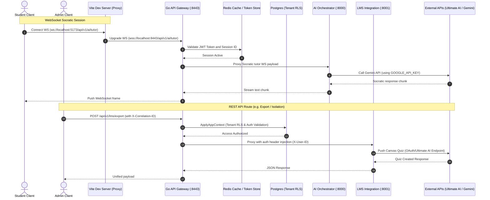

# API Gateway Wrapper Integration Plan

This document outlines the architecture, environment schema, backend proxy configuration, and frontend hook pattern for integrating the **SafeScholar API Gateway Wrapper (`SafeScholarGatewayServiceWrapper`)** into a production full-stack application.

---

## 1. Architecture & Data Flow

Below is the Mermaid sequence diagram representing request execution, RLS checks, and secure API key encapsulation through the Go Gateway and downstream services:



---

## 2. Environment & Security Config Schema

To maintain key isolation, the following **Zod** validator script ensures that required environment variables are parsed and validated at runtime, preventing the application from booting with invalid configuration.

### `.env.example`
```env
# Server Config
PORT=3000
NODE_ENV=production

# SafeScholar API Gateway Credentials
SAFESCHOLAR_GATEWAY_URL=https://localhost:8443
SAFESCHOLAR_SERVICE_TOKEN=sec_token_hash_here

# Third-Party Upstream Credentials (Encapsulated Server-Side)
ULTIMATE_AI_API_KEY=sk-ultimate_ai_api_key_placeholder
ULTIMATE_AI_BASE_URL=https://smart.ultimateai.org/v1
GEMINI_API_KEY=gemini_api_key_placeholder
```

### `lib/api/config.ts` (Zod Validator)
```typescript
import { z } from 'zod';

const envSchema = z.object({
  PORT: z.coerce.number().default(3000),
  NODE_ENV: z.enum(['development', 'production', 'test']).default('development'),
  SAFESCHOLAR_GATEWAY_URL: z.string().url(),
  SAFESCHOLAR_SERVICE_TOKEN: z.string().min(16),
  ULTIMATE_AI_API_KEY: z.string().startsWith('sk-'),
  ULTIMATE_AI_BASE_URL: z.string().url().default('https://smart.ultimateai.org/v1'),
  GEMINI_API_KEY: z.string().min(10),
});

export const validateEnv = () => {
  const result = envSchema.safeParse(process.env);
  if (!result.success) {
    console.error('❌ Invalid environment configuration:', result.error.format());
    process.exit(1);
  }
  return result.data;
};

export const env = validateEnv();
```

---

## 3. Gateway Wrapper Service Layer (`lib/api/gatewayClient.ts`)

A type-safe backend wrapper class that abstracts authentication, tracking headers, retry policies, and error handling for upstream gateway API calls:

```typescript
import axios, { AxiosInstance } from 'axios';
import { env } from './config';

export interface LMSExportPayload {
  user_id: string;
  target_lms: 'canvas' | 'google_classroom';
  payload: {
    course_id: string;
    title: string;
    description: string;
    questions: Array<{
      question_text: string;
      options: string[];
      correct_answer_index: number;
      points: number;
    }>;
  };
}

export class GatewayClient {
  private client: AxiosInstance;

  constructor() {
    this.client = axios.create({
      baseURL: env.SAFESCHOLAR_GATEWAY_URL,
      timeout: 15000,
      headers: {
        'Content-Type': 'application/json',
        'Authorization': `Bearer ${env.SAFESCHOLAR_SERVICE_TOKEN}`,
      },
    });

    // Implement Exponential Backoff Retry Policy
    this.client.interceptors.response.use(
      (response) => response,
      async (error) => {
        const { config } = error;
        if (!config || !config.retryCount || config.retryCount >= 3) {
          return Promise.reject(error);
        }
        config.retryCount = config.retryCount || 0;
        config.retryCount += 1;
        const delay = Math.pow(2, config.retryCount) * 1000;
        await new Promise((resolve) => setTimeout(resolve, delay));
        return this.client(config);
      }
    );
  }

  public async exportLMS(data: LMSExportPayload, correlationId: string) {
    try {
      const response = await this.client.post('/api/v1/lms/export', data, {
        headers: {
          'X-Correlation-ID': correlationId,
          'X-SS-Correlation-ID': correlationId,
        },
      });
      return response.data;
    } catch (error: any) {
      this.handleError(error);
    }
  }

  private handleError(error: any) {
    const status = error.response?.status || 500;
    const message = error.response?.data?.error || 'Upstream Gateway Error';
    console.error(`[GatewayClient Error] Status: ${status}, Message: ${message}`);
    throw new Error(message);
  }
}

export const gatewayClient = new GatewayClient();
```

---

## 4. Server Proxy / API Route Controllers (`pages/api/export.ts`)

A secure Next.js API route controller acting as a proxy layer. It validates user authentication and forwards requests to the Gateway Wrapper:

```typescript
import type { NextApiRequest, NextApiResponse } from 'next';
import { gatewayClient } from '../../lib/api/gatewayClient';

export default async function handler(req: NextApiRequest, res: NextApiResponse) {
  if (req.method !== 'POST') {
    res.setHeader('Allow', ['POST']);
    return res.status(405).json({ error: 'Method Not Allowed' });
  }

  // 1. Verify User Session / JWT
  const userToken = req.headers.authorization;
  if (!userToken) {
    return res.status(401).json({ error: 'Unauthorized: Session missing' });
  }

  // 2. Validate correlation headers
  const correlationId = (req.headers['x-correlation-id'] as string) || crypto.randomUUID();

  try {
    const result = await gatewayClient.exportLMS(req.body, correlationId);
    return res.status(200).json(result);
  } catch (error: any) {
    return res.status(502).json({ error: error.message || 'LMS Export failed' });
  }
}
```

---

## 5. Client-Side SWR Data Hook (`hooks/useLMSExport.ts`)

A reusable React hook encapsulating state transitions (loading, error, success) for calling the proxy API:

```typescript
import { useState } from 'react';

export function useLMSExport() {
  const [loading, setLoading] = useState(false);
  const [error, setError] = useState<string | null>(null);
  const [success, setSuccess] = useState<string | null>(null);

  const triggerExport = async (payload: any, accessToken: string) => {
    setLoading(true);
    setError(null);
    setSuccess(null);

    const correlationId = crypto.randomUUID();

    try {
      const response = await fetch('/api/export', {
        method: 'POST',
        headers: {
          'Content-Type': 'application/json',
          'Authorization': `Bearer ${accessToken}`,
          'X-Correlation-ID': correlationId,
        },
        body: JSON.stringify(payload),
      });

      if (!response.ok) {
        const errData = await response.json();
        throw new Error(errData.error || 'Failed to export contents.');
      }

      const data = await response.json();
      setSuccess(`Export successful! Assignment ID: ${data.external_id}`);
      return data;
    } catch (err: any) {
      setError(err.message || 'An error occurred during LMS export.');
    } finally {
      setLoading(false);
    }
  };

  return { triggerExport, loading, error, success };
}
```

---

## 6. Security Hardening Checklist (OWASP Top 10 Aligned)

1. **CORS Configuration**: Restrict allowable origins in the Go Gateway `config.dev.yaml` explicitly to front-end hosts. Downstream services (`ai-orchestrator` and `lms-integration`) must reject all direct non-gateway client origins.
2. **CSP Headers**: Enforce a strict `Content-Security-Policy` prohibiting arbitrary `connect-src` endpoints.
3. **Transport Security (TLS)**: Ensure all production communication is bound to `TLS 1.3`. Postgres connection strings must use `sslmode=verify-full`.
4. **Credential Rotation & Vault Storage**: Never store production keys inside git. Use secure KMS vaults (e.g., AWS Secrets Manager, HashiCorp Vault) to inject environment variables at runtime.
5. **Rate Limiting**: Enforce per-tenant limits utilizing the Redis Lua script token-bucket rate limiter.
6. **Input Sanitization**: Strip dangerous HTML, SQL injection patterns, and control characters from client payloads inside the proxy controller before forwarding to the gateway.
